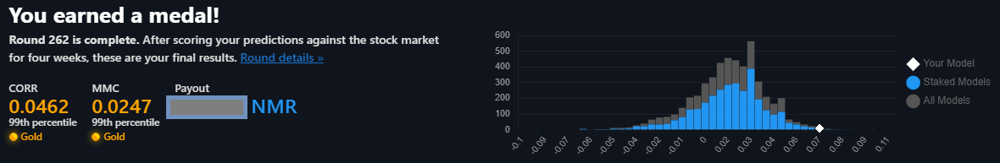
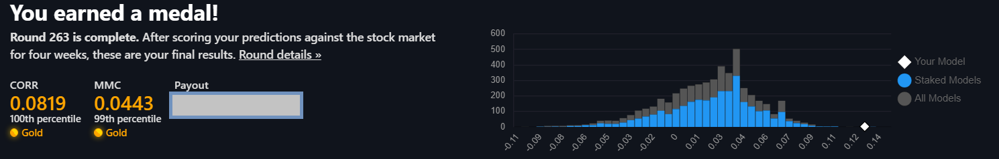
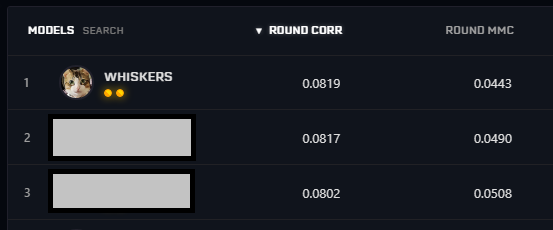
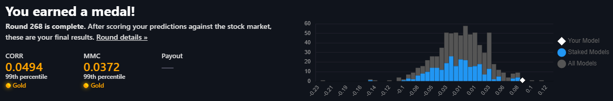

# Numerai Tournament
## Introduction
Numerai is a hedge fund that trades the global markets based on models created by data scientists all over the world. Numerai is unique in that it provides free high-quality financial datasets that are worth millions of dollars to any user wanting to participate in their tournament. Users are able to build their own models on this anonymized and obfuscated dataset, submit their predictions, and follow their investment performance on the live stock market. If users are confident about their models, they are able to stake on them with real money using Numerai's cryptocurrency, Numeraire (NMR).

## My Models
### Main Tournament
I started building and submitting models for the main tournament at round 255 so I am relatively new. I have three main models that are all named after my cat Winston. These models have accumulated multiple bronze, silver, and gold medals with my best performing model in the 100th percentile (ranked 1st in correlation of **all** models) in round 263. My highest staked model is currently in the top 100 in CORR, MCC, and FNC. 

**Model 1: SirWinstonPurchill** 
 https://numer.ai/sirwinstonpurrchill
* 2 Gold Medals (Top 1% in CORR and MMC for round 262)

**Model 2: Whiskers**
* This is currently my best model in the tournament. Not making the model code public.
* Ranked #1 in correlation for round 263 (2 Gold Medals)
* Top 100 in CORR, MCC, and FNC

**Model 3: Clowder** 
 https://numer.ai/clowder
* This is an ensembled model from multiple models I created for the tournament. 

### Signals Tournament
**Model 1: SZA**
 https://signals.numer.ai/sza
* 2 Gold Medals (Top 1% in CORR and MMC. 3rd in CORR & 3rd in MMC)
* Model composed of alternative and technical features

### About this Notebook
It is much easier to run the notebook on Google Colab (Pro) because the library dependencies are much smoother. You may need to upgrade to colab pro as I have to get access to higher RAM and GPU capabilities.

The purpose of this notebook is to provide an introduction on how to approach the main Numerai tournament.

What's included:
* how to read in the Numerai data via API
* approaches to dimensionality reduction
* training an xgboost model 
* bayesian optimization techniques
* calculating predictions from the current round

### Libraries
* numpy
* pandas
* sklearn
* xgboost
* tensorflow
* bayesian-optimization
* numerapi

### Disclaimer
**This model is not guaranteed to make you money.** I am currently not staking this particular model in the tournament. This notebook only serves to provide you an introduction to the tournament and to give some of my personal input on how to tackle this data science problem. 
